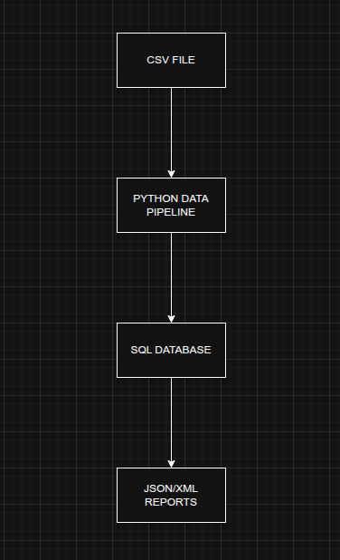

# Architecture Diagram

## Overview
This diagram shows how data moves through the system.

## Components

### CSV File
Data submitted by volunteers.

### Python Data Pipeline
Processes and prepares the data.

### SQL Database
Stores the validated data.

### JSON/XML Reports
Outputs the data in structured formats.