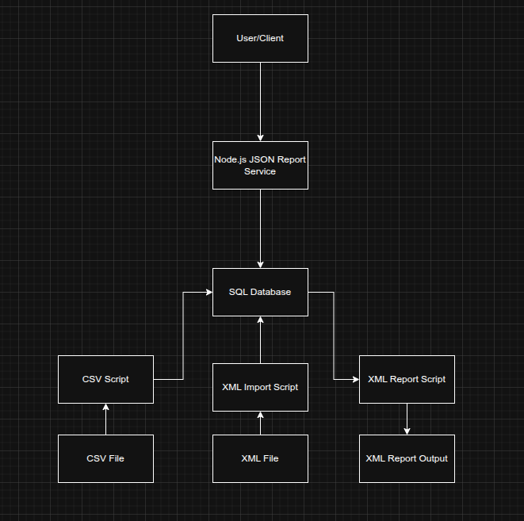

# Data Flow Diagram

## Overview
This diagram shows how data flows through the system.

## Components

### User / Client
Represents the user running scripts or requesting data from the system.

### CSV File
Contains wildlife survey data submitted by volunteers.

### Python CSV Ingestion Script
Reads CSV files, validates each row, logs errors and inserts valid data into the database.

### XML File (Partner Data)
Represents external survey data provided in XML format by a partner organisation.

### Python XML Import Script
Parses the XML file, extracts survey and observation data and inserts it into the database.

### Node.js JSON Report Service
Handles user requests and retrieves data from the database, returning it in JSON format.

### SQL Database (MariaDB)
Stores all validated survey data, including sites, species, survey sessions and sightings.

### Python XML Report Script
Queries the database and generates a structured XML report for endangered species alerts.

### XML Report Output
The generated XML report containing structured alert data.