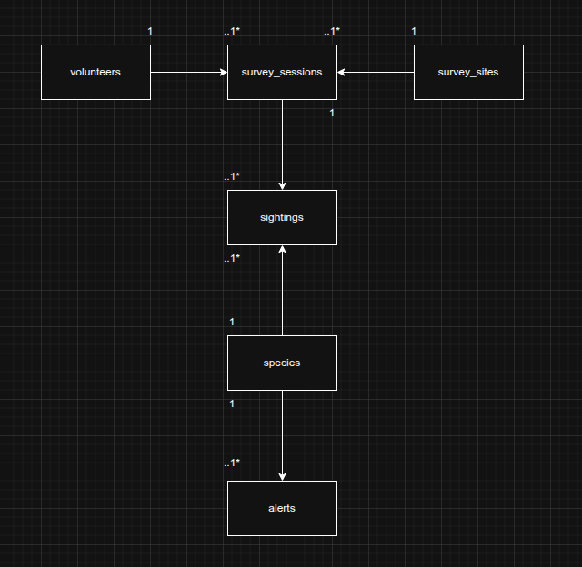

# ER Diagram

## Overview
This diagram displays the different entities and how they are related.

## Entities
The main entities are:
- volunteers
- survey_sites
- survey_sessions
- species
- sightings
- alerts

These were taken directly from the project brief.

## Relationships
- A volunteer can complete many survey sessions
- A survey site can have many survey sessions
- A survey session can contain many sightings
- A species can have many sightings
- A species can have many alerts
