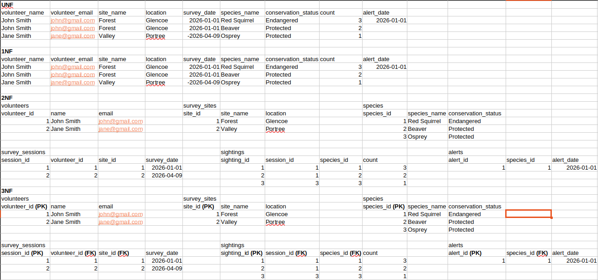

# Normalisation

## Overview
This document explains how wildlife survey sample data was normalised from UNF to 3NF

---

## Unnormalised Form (UNF)
All data was stored in one large table. This caused repeated data, meaning the same volunteer and site details could appear more than once if multiple species were recorded during the same survey.

---

## First Normal Form (1NF)
To move to 1NF the data was checked so that each field contained a single value and each row represented one sighting record. The data already followed this rule.

---

## Second Normal Form (2NF)
To move to 2NF repeated data was split into separate tables. This meant volunteer details were stored once in volunteers, site details were stored once in survey_sites and species details were stored once in species. The sightings table then used IDs instead of repeating names.

---

## Third Normal Form (3NF)
To move to 3NF the tables were checked for transitive dependencies.

A transitive dependency is where one non key field depends on another non key field instead of depending only on the primary key. These issues were already fixed when the data was split for 2NF, so the table structure did not need to change for 3NF.

